# Relatório de Atividades
## Aula 2.1  - Controle de Versões

**Data:** 29/04/2026 - 05/05/2026

---

## Atividade 1: Gerando Versões

### 1. Minha estratégia para identificar versões:
 Utilizaria o Versionamento Semântico (SemVer) no formato `M.m.p` (Major.minor.patch).

**Justificativa:**
- É o padrão mais utilizado na indústria
- Comunica claramente o impacto das mudanças
- Facilita o gerenciamento de dependências
- É intuitivo para desenvolvedores e usuários

### 2. Primeira versão para o público:
```
1.0.0
```
Indica a primeira versão estável e pronta para produção.

### 3. Nova funcionalidade implementada:
```
1.1.0
```
Minor incrementado (nova funcionalidade mantendo compatibilidade), patch zerado.

### 4. Histórico de versões com SemVer:
```
0.1.0  -> Versão inicial de desenvolvimento
0.2.0  -> Novas funcionalidades em desenvolvimento
1.0.0  -> Primeira release pública
1.1.0  -> Nova funcionalidade adicionada
```

### 5. Série de 3 correções + 2 funcionalidades + 2 correções:
Partindo de `1.1.0`:
```
1.1.0 -> 1.1.1 (correção 1)
1.1.1 -> 1.1.2 (correção 2)
1.1.2 -> 1.1.3 (correção 3)
1.1.3 -> 1.2.0 (funcionalidade 1)
1.2.0 -> 1.3.0 (funcionalidade 2)
1.3.0 -> 1.3.1 (correção 4)
1.3.1 -> 1.3.2 (correção 5)
```
**Versão mais recente: 1.3.2**

### 6. Mudança crítica na API + funcionalidade + 2 correções:
```
1.3.2 -> 2.0.0 (breaking change na API)
2.0.0 -> 2.1.0 (nova funcionalidade)
2.1.0 -> 2.1.1 (correção 1)
2.1.1 -> 2.1.2 (correção 2)
```
**Histórico final:**
```
1.0.0 -> 1.1.0 -> 1.1.1 -> 1.1.2 -> 1.1.3 -> 1.2.0 -> 1.3.0 -> 1.3.1 -> 1.3.2 -> 2.0.0 -> 2.1.0 -> 2.1.1 -> 2.1.2
```

### 7. Exemplos reais de versões:

| Termo | Exemplo Real |
|-------|--------------|
| **Alpha** | Android 15 Alpha, Chrome Canary |
| **Beta** | Windows 11 Insider Preview Beta |
| **Release Candidate** | Python 3.12.0rc1 |
| **Release** | Ubuntu 24.04 LTS |
| **Post-release fix** | Node.js 20.11.1 |
| **LTS** | Node.js 20 LTS, Ubuntu 22.04 LTS |

---

## Atividade 2: Instalação e Configuração do Git

### Passos realizados:

**Nota:** no momento que a tarefa foi realizada, o git ja estava configurado. Logom algumas partes dessa atividade não serão mostradas explicitamente atravez de screenshots.

```bash
# 1. Verificar instalação do Git
git --version
# Saída: git version 2.43.0

# 2. Configurar identidade
git config --global user.name "Seu Nome"
git config --global user.email "seu.email@exemplo.com"


# 3. Verificar configurações
git config --list

# 4. Testar ajuda
git help config
git commit --help
```
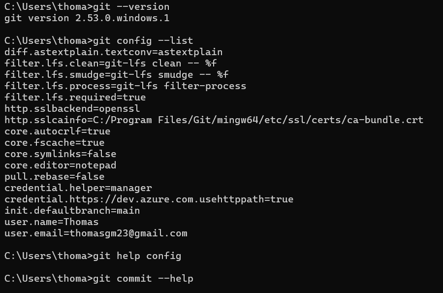

### git commit --help :

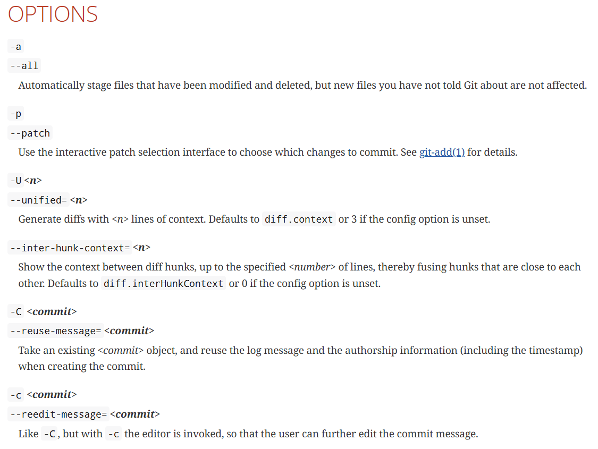

### git config --list:
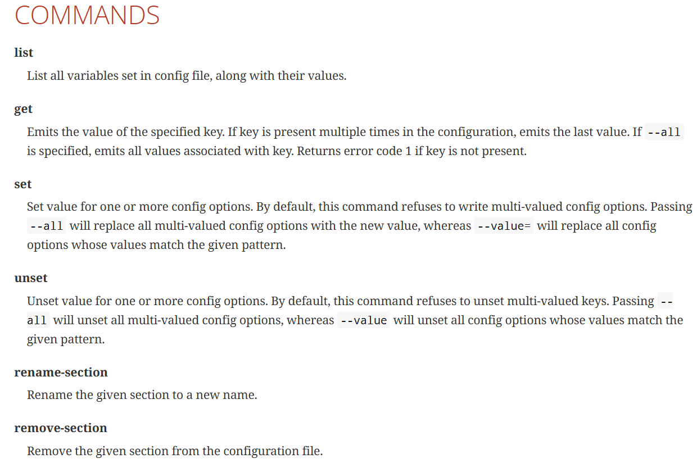


### Resultado:
- Git instalado corretamente
- Configurações de usuário definidas
- Sistema de ajuda funcionando

---

## Atividade 3: Repositórios e Primeiros Passos

### 1. Projetos interessantes no GitHub:

| Projeto | Descrição | URL |
|---------|-----------|-----|
| **freeCodeCamp** | Plataforma de aprendizado de programação | github.com/freeCodeCamp/freeCodeCamp |
| **VS Code** | Editor de código da Microsoft | github.com/microsoft/vscode |
| **React** | Biblioteca JavaScript para UIs | github.com/facebook/react |

### 2. Clonando um projeto:

```bash
# Clonar repositório de exemplo
git clone https://github.com/praqma-training/git-katas.git

# Verificar o que foi criado
ls -la git-katas/
# Resultado: pasta .git + arquivos do projeto
```
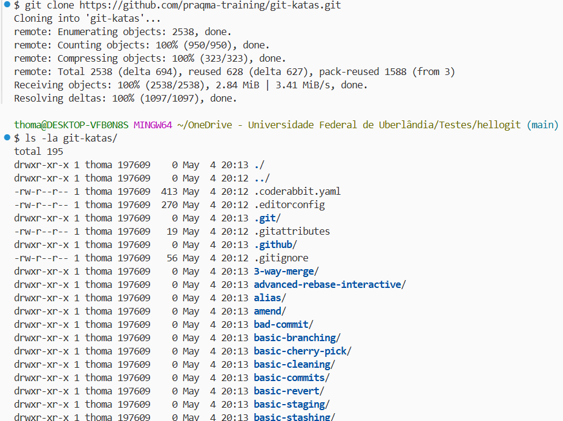


### 3-5. Criando repositório Hello Git:

```bash
# Criar pasta e inicializar repositório
mkdir hellogit
cd hellogit
git init

# Verificar criação do .git
ls -la
# Resultado: pasta .git criada

# Criar arquivo em branco
touch Hello.java
git add Hello.java
git commit -m "Adiciona arquivo Hello.java vazio"
```
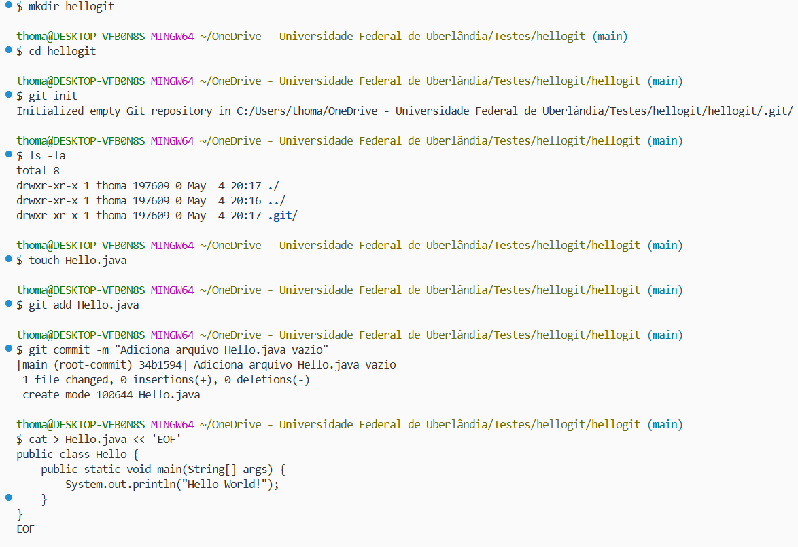
Arquivo criado: [Hello.java](laboratorio-git/hellogit/Hello.java)

```bash

# Adicionar código
cat > Hello.java << 'EOF'
public class Hello {
    public static void main(String[] args) {
        System.out.println("Hello World!");
    }
}
EOF

git add Hello.java
git commit -m "Implementa Hello World em Java"
```


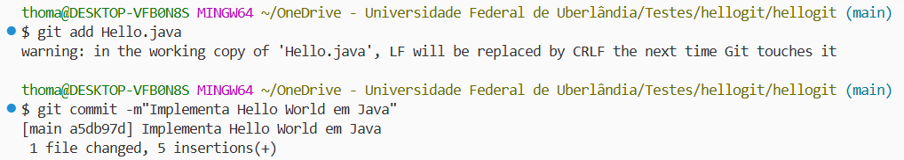

---

## Atividade 4: Ignorando Arquivos (.gitignore)

### 1. Análise do arquivo .gitignore proposto:

```gitignore
!lib.a
/TODO
build/
doc/*.txt
doc/**/*.pdf
```

| Regra | Resultado Esperado |
|-------|-------------------|
| `!lib.a` | **Inclui** lib.a mesmo que exista regra para ignorar *.a |
| `/TODO` | Ignora arquivo TODO apenas na raiz do repositório |
| `build/` | Ignora toda a pasta build/ e seu conteúdo |
| `doc/*.txt` | Ignora arquivos .txt diretamente em doc/, mas não em subpastas |
| `doc/**/*.pdf` | Ignora todos os .pdf em doc/ e qualquer subpasta |

### 2-4. Ignorando arquivos temporários:

```bash
touch hello.tmp

git status

echo "*.tmp" >> .gitignore

git status

git add .gitignore
git commit -m "Adiciona .gitignore para ignorar arquivos temporários"
```
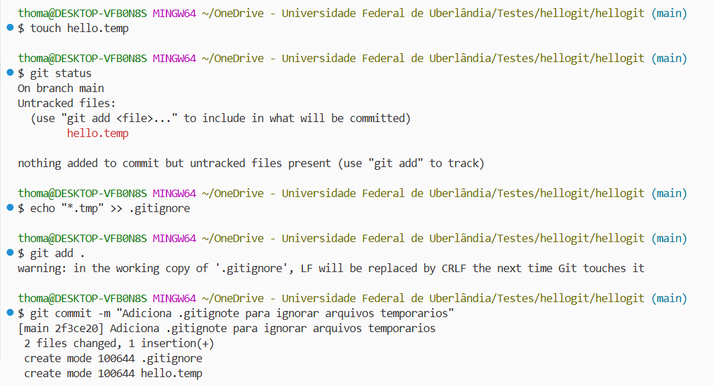

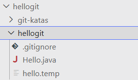

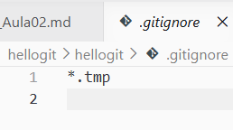
---

## Atividade 5: Estados e Diferenças

### 1-3. Alterando Hello.java:

```bash
# Modificar para 10 saídas
cat > Hello.java << 'EOF'
public class Hello {
    public static void main(String[] args) {
        for (int i = 0; i < 10; i++) {
            System.out.println("Hello Git!");
        }
    }
}
EOF
```

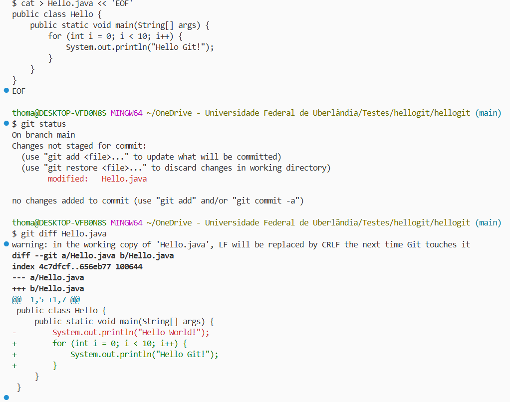

```bash
# Verificar status
git status
# Saída: modified: Hello.java

# Verificar diferenças
git diff Hello.java
# Mostra linhas removidas (-) e adicionadas (+)

# Registrar alteração
git add Hello.java
git commit -m "Modifica Hello para exibir 10 mensagens"
```
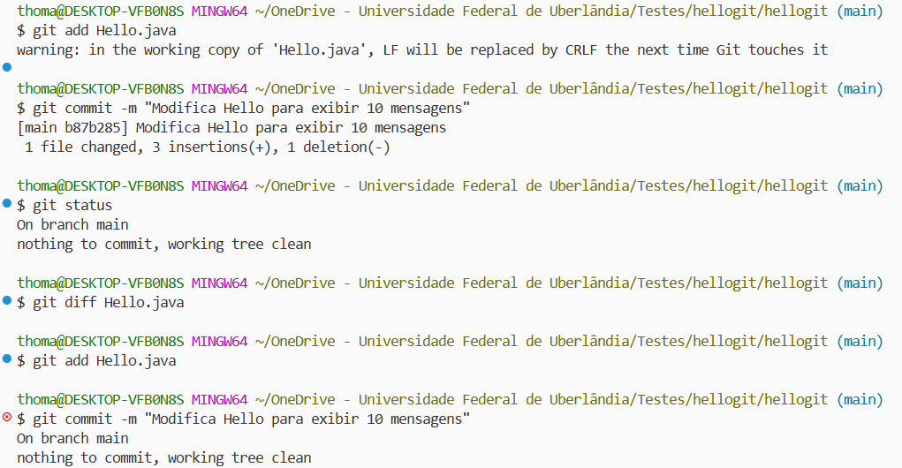


### 4-6. Criando, renomeando e removendo arquivo:

```bash
# Criar arquivo de orientações
cat > hello.txt << 'EOF'
# Orientações sobre Git

## Comandos básicos:
- git init: inicializa repositório
- git add: adiciona ao stage
- git commit: registra alterações
- git status: verifica estado
EOF

git add hello.txt
git commit -m "Adiciona arquivo de orientações sobre Git"

# Renomear arquivo
git mv hello.txt hello.md
git commit -m "Renomeia hello.txt para hello.md (formato Markdown)"

# Remover arquivo
git rm hello.md
git commit -m "Remove arquivo hello.md"
```
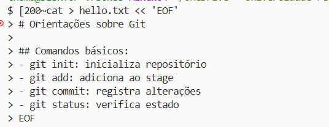
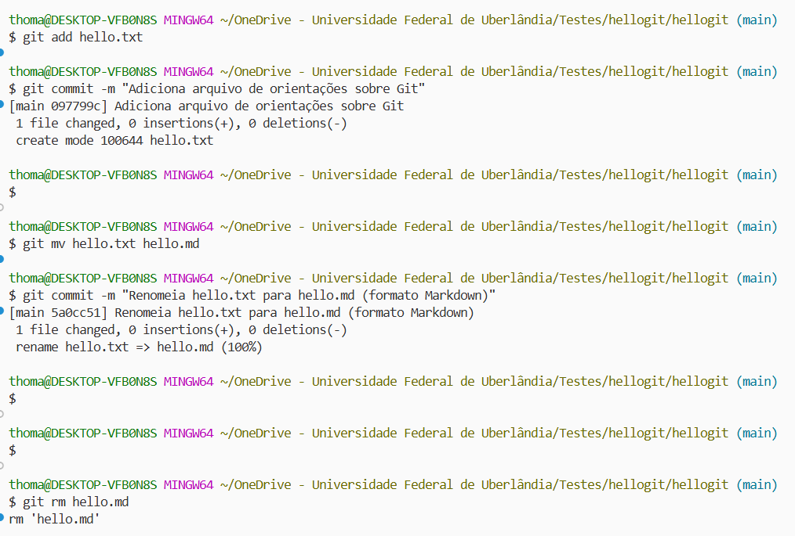
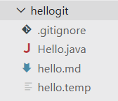
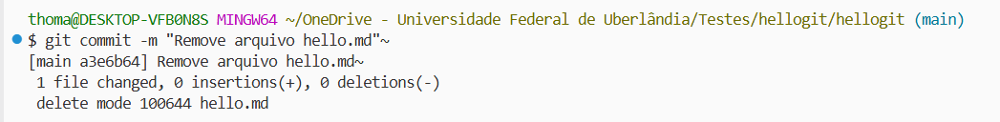

---

## Atividade 6: Histórico de Commits

### 1. Testando comandos de histórico:

```bash
git clone https://github.com/schacon/simplegit-progit
cd simplegit-progit
git log
git log -p -2
git log --stat
git log --pretty=oneline
git log --pretty=format:"%h - %an, %ar : %s"
git log --pretty=format:"%h %s" --graph
```
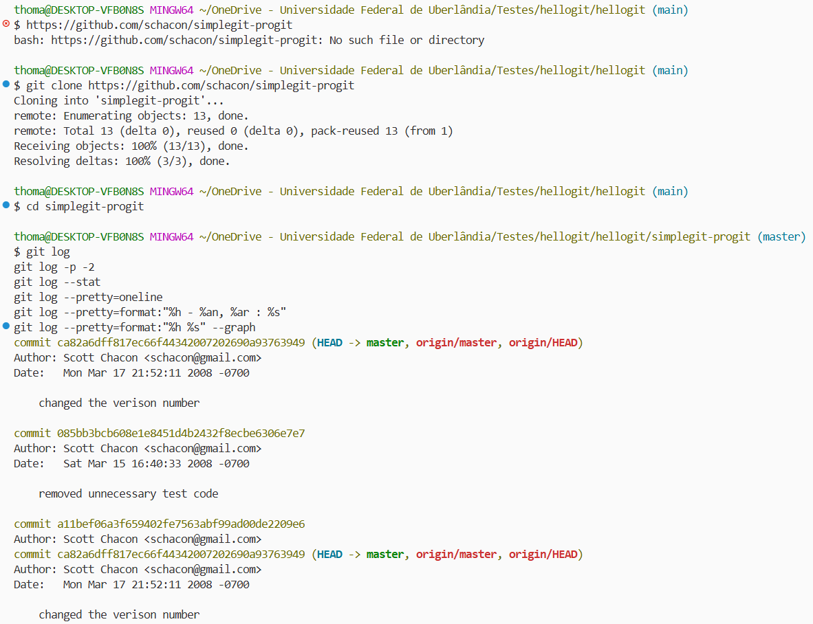
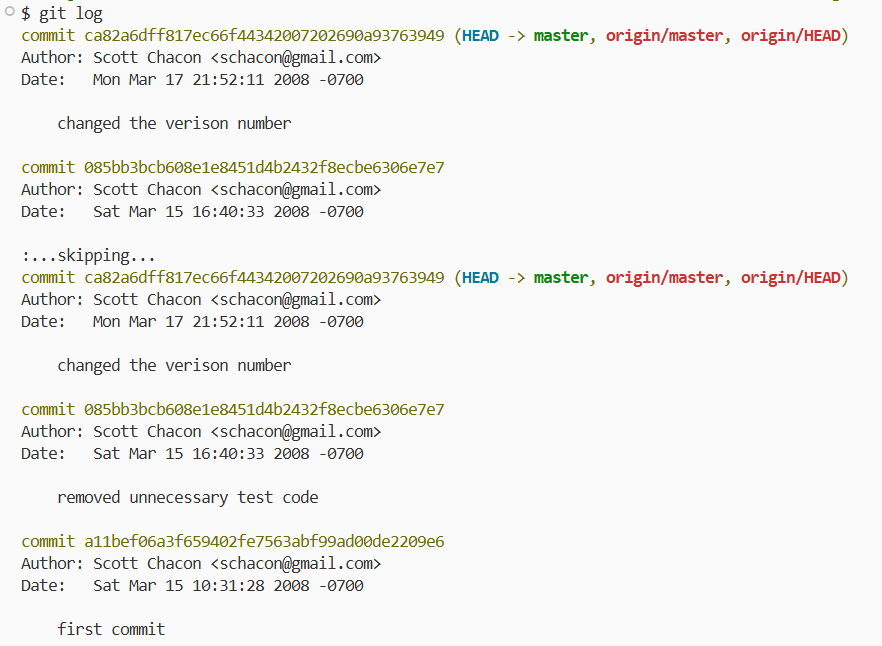
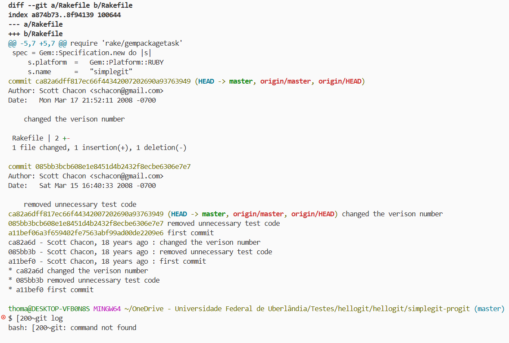
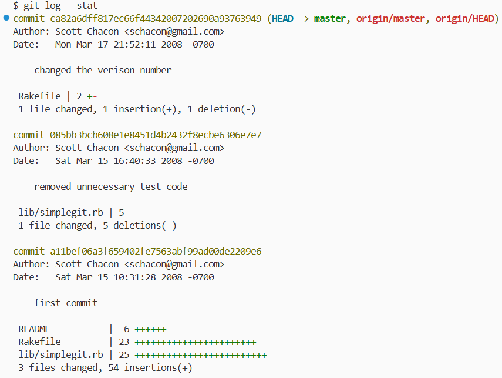
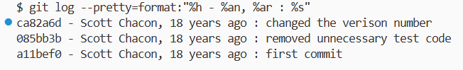
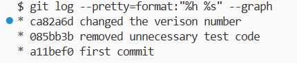


### 2-3. Consulta avançada no repositório do Git:

```bash
git log --pretty="%h - %s" --author=gitster --since="2008-10-01" --before="2008-11-01" --no-merges -- t/

# Interpretação:
# - %h - %s: formato hash curto - mensagem
# - --author=gitster: apenas commits do autor "gitster"
# - --since/--before: período de outubro de 2008
# - --no-merges: exclui commits de merge
# - -- t/: apenas alterações na pasta t/
```
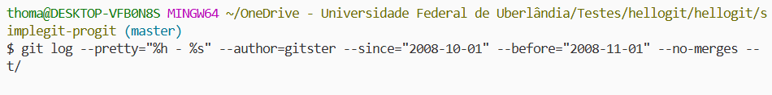
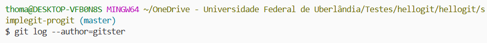

Ou seja, nesse repositório simplegit-progit, provavelmente não existe commit com autor `gitster` nem histórico envolvendo a `pasta t/`.

---

## Atividade 7: Desfazendo Alterações

### 1-2. Usando git commit --amend:

````bash
# Criar arquivo de reparo
cat > reparo.md << 'EOF'
# Comando git commit --amend

Permite corrigir o último commit, adicionando arquivos esquecidos
ou alterando a mensagem.

## Uso:
```
git commit --amend
git commit --amend -m "Nova mensagem"
git commit --amend --no-edit

```
EOF

git add reparo.md
git commit -m "Adiciona documentação sobre amend"

# Criar arquivo esquecido
cat > referencias.md << 'EOF'
# Referências

- Pro Git Book: https://git-scm.com/book
- Git Documentation: https://git-scm.com/doc
EOF

# Emendar ao commit anterior
git add referencias.md
git commit --amend --no-edit

# Verificar que o commit foi atualizado
git log -1
````

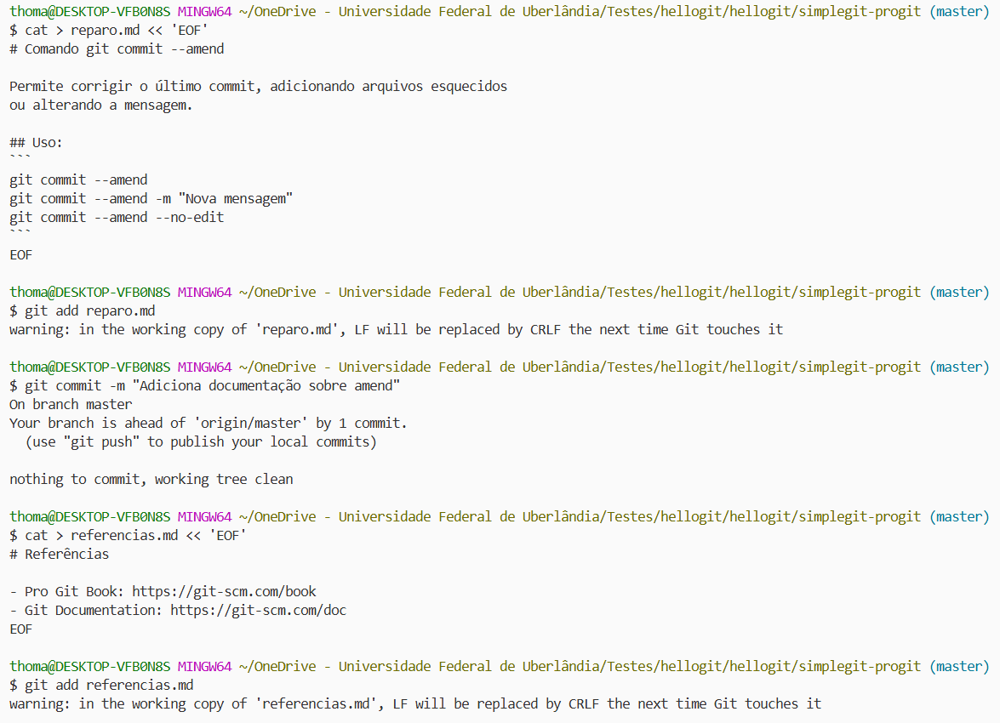
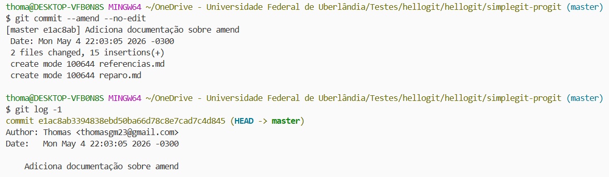

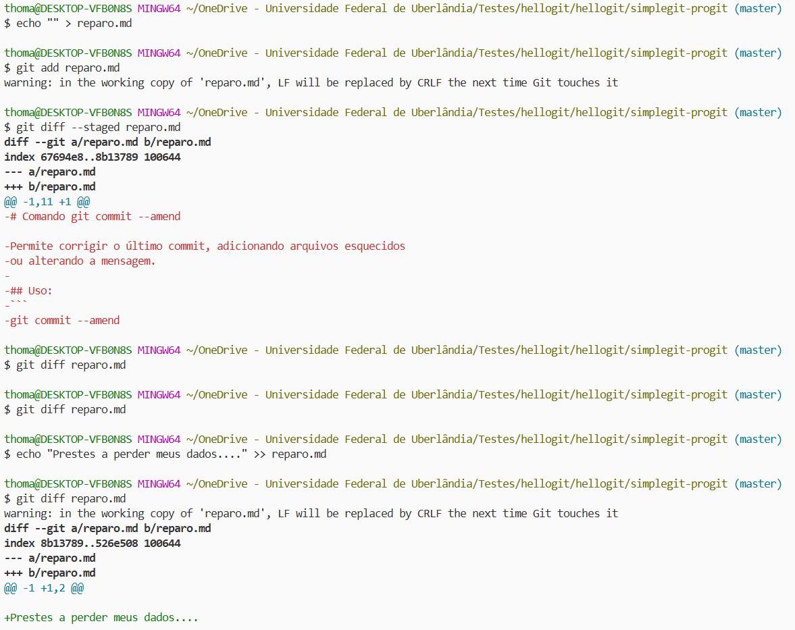
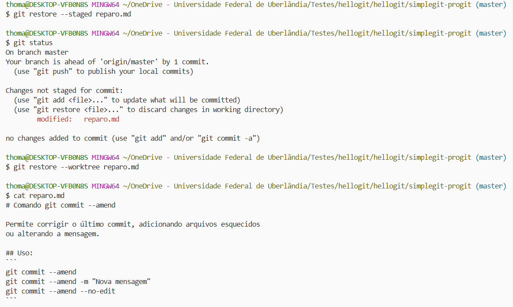

### 3-6. Removendo do Stage e restaurando:

```bash
echo "" > reparo.md
git add reparo.md
git diff --staged reparo.md  
git diff reparo.md           
echo "Prestes a perder meus dados...." >> reparo.md
git diff reparo.md
git restore --staged reparo.md
git status
git restore --worktree reparo.md
cat reparo.md
```

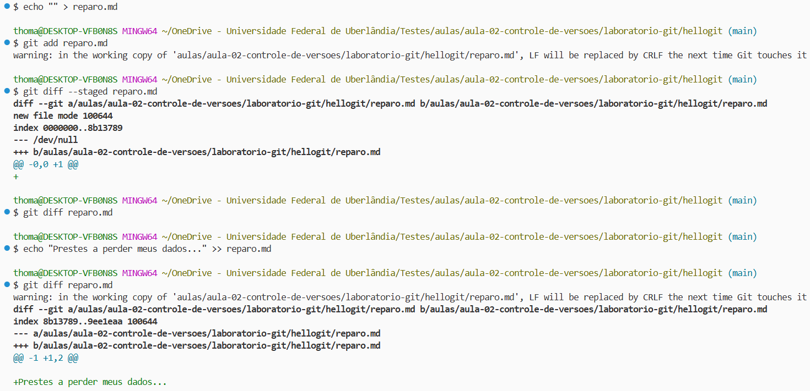
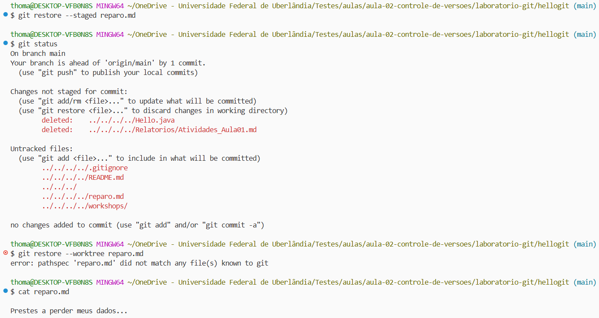

---

## Atividade 8: Tags

### 1-2. Pesquisando uso de tags em repositórios:

**1. Projetos pesquisados anteriormente (Atividade 3):**

| Projeto já pesquisado | Há tags de versão? | Esquema de versionamento observado | Exemplos |
|---|---|---|---|
| `facebook/react` | Sim | SemVer com prefixo `v` | `v19.2.6`, `v19.1.7`, `v19.0.6` |
| `microsoft/vscode` | Sim | Major.Minor.Patch (sem `v` na série principal) | `1.118.1`, `1.118.0`, `1.117.0` |

Logo, nos projetos já pesquisados, as tags são usadas para marcar versões/release do projeto, com convenções de nome diferentes entre repositórios.

**2. Outros projetos conhecidos (análise de uso das tags):**

| Repositório | Como são nomeadas | Quais commits foram marcados | Quais informações foram registradas | Frequência de criação |
|---|---|---|---|---|
| `nodejs/node` | `vMAJOR.MINOR.PATCH` (ex.: `v26.1.0`) | Commits de release específicos | Mensagem de release, data e assinatura/verificação GPG | Frequente (dias/semanas entre tags recentes) |
| `torvalds/linux` | `vX.Y` e `vX.Y-rcN` | Commits de fechamento de ciclo (`rc`) e versão final | Mensagem curta da versão, hash e data da tag | Quase semanal durante janela `rc`; versão final após a sequência |

Logo, as tags servem como marcos formais no histórico, mas cada projeto adota estratégia própria de nome, conteúdo e cadência.


### 3-6. Trabalhando com tags:

```bash
git tag
git tag -l "v1.1*"
git tag -a v1.0.0 -m "Primeira versão estável"
git tag v1.0.1-beta
git show v1.0.0
git show v1.0.1-beta
git log --oneline -5
git tag -a v0.9.0 -m "Versão beta" abc1234 

# Diferença entre tags anotadas e leves:
# - Anotadas: objeto completo com metadados (autor, data, mensagem)
# - Leves: apenas ponteiro para um commit
```
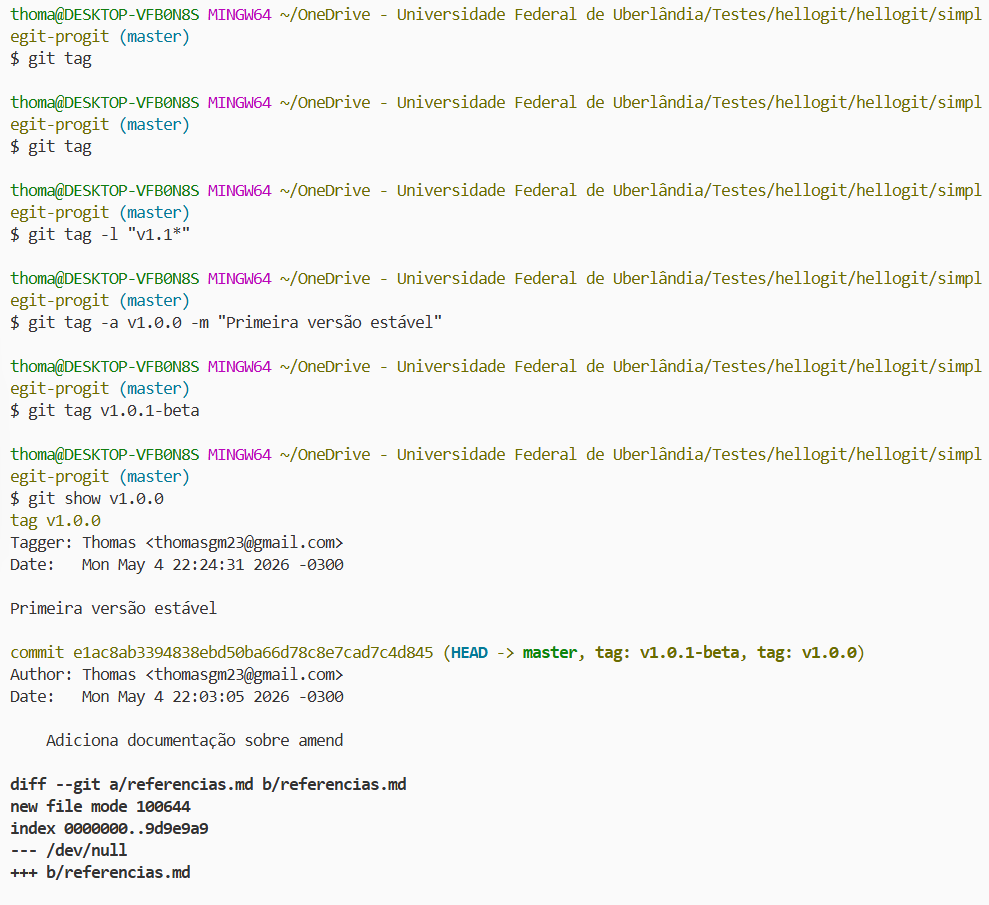
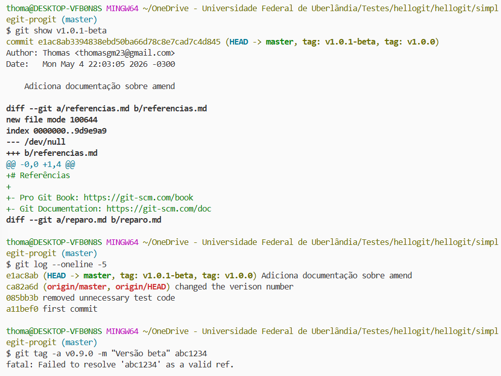

---

## Registro de Progresso

### O que foi feito:
- [x] Estudo de esquemas de versionamento (SemVer, CalVer, Nominal)
- [x] Instalação e configuração do Git
- [x] Criação de repositórios (init e clone)
- [x] Operações básicas (add, commit, status)
- [x] Configuração de .gitignore
- [x] Análise de diferenças (git diff)
- [x] Navegação pelo histórico (git log)
- [x] Correção de commits (amend)
- [x] Desfazer alterações (restore)
- [x] Trabalho com tags


### O que ficou pendente:
- [ ] Explorar mais projetos open source para análise de tags
- [ ] Praticar mais cenários de conflitos no staging

### O que impediu:
- Nenhum impedimento significativo nesta aula

### O que será feito na sequência:
- Estudar branches e merges (próximas aulas)
- Explorar repositórios remotos (push, pull, fetch)
- Praticar comandos

---

## Referências

- [Site Oficial do Git](https://git-scm.com/)
- [Pro Git Book](https://git-scm.com/book/en/v2)
- [Semantic Versioning](https://semver.org/)
