# Diário de Atividades - TMS 2025/2

## Aula 4 - Controle de Versões
**Data:** 18/05/2026 - 21/05/2026

# Aula 4.1 - Repositórios Remotos

## Atividade 1: Criar e Configurar Repositório Remoto

### Passos realizados:

```bash
# 1 Criar repositório no GitHub chamado "meu_remoto"
# (feito via interface web do GitHub)

# 2 clonar repositório localmente
git clone https://github.com/seu-usuario/meu_remoto.git
cd meu_remoto

# 3 listar estado do repositório
git remote -v

# 4 Criar README no GitHub via interface web
# Conteúdo: "Como utilizar este repositório:"

# 5 Verificar alterações via linha de comando
git fetch origin
git log origin/main --oneline

# 6 Renomear referência do repositorio
git remote rename origin r1
git remote -v
```
 [Link do repositório criado " meu_remoto"](https://github.com/thomasmota1/meu_remoto.git)

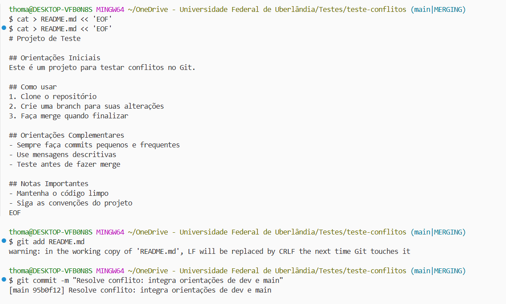

---

## Atividade 2: Sincronização Local/Remoto

```bash
# 1 Observar referências
git ls-remote r1
git branch -vv

# 2 Atualizar repositório local
git pull r1 main

# 3 Editar README
echo "1. Leia o Livro Pro Git para revisar os comandos" >> README.md

# 4 Fazer commit local
git add README.md
git commit -m "Adiciona primeira orientação ao README"

# 5 Verificar diferenças local/remoto
git status
git log --oneline r1/main..HEAD
# Mostra commits locais não enviados

# 6 Ver divergencias
git log --oneline --all --graph
```
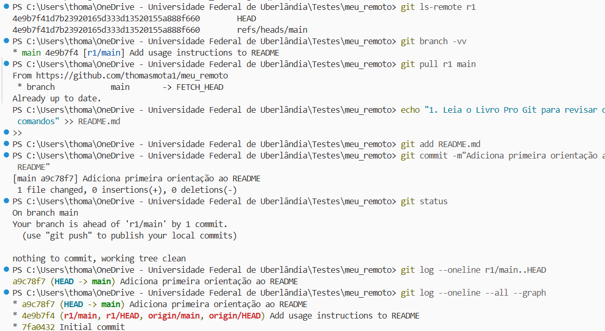
---

## Atividade 3: Compartilhar Repositório

```bash

#  Adicionar repositório do colega
git remote add colega https://github.com/colega/meu_remoto.git

# Editar README
echo "2. Pratique os comandos com as atividades propostas" >> README.md

# Commit local
git add README.md
git commit -m "Adiciona segunda orientação"

# Verificar diferenças entre repositórios
git fetch r1
git fetch colega
git log --oneline --all --graph
```
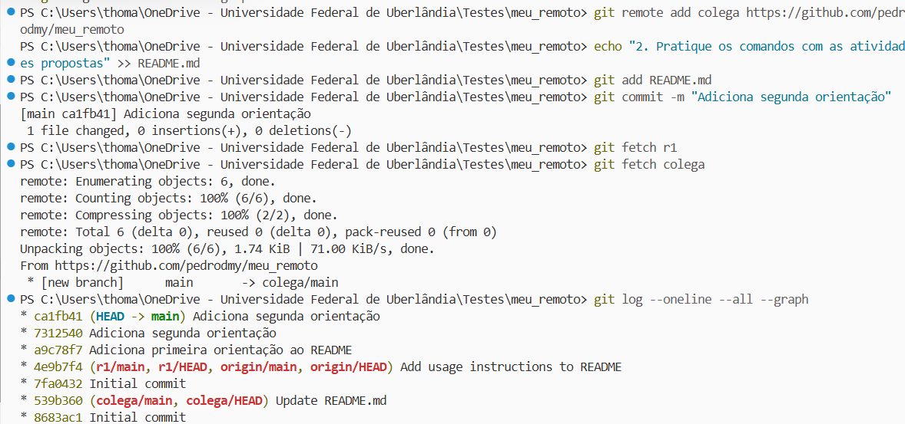

---

## Atividade 4: Enviar Dados para o Remoto

```bash
# 1 Verificar estado
git status

# 2 Enviar mudanças
git push r1 main

# 3 Colega atualiza repositório dele
# Colega executa: git pull origin main

# 4 Colega faz alterações e envia
# Colega executa:
#   echo "3. Contribua com o projeto" >> README.md
#   git add README.md
#   git commit -m "Adiciona terceira orientação"
#   git push origin main

# 5 Atualizar repositório local
git pull r1 main

# 6 Verificar diferenças
git log --oneline --all --graph
```
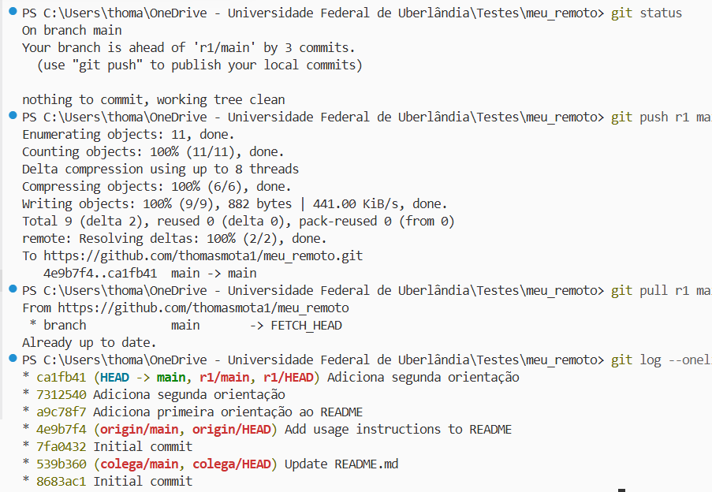

---

## Atividade 5: Colaborando com Ramos Remotos (1)

```bash
# 1. Criar ramo local dev1
git checkout -b dev1

# 2. Editar README
echo "## Seção Dev1" >> README.md
echo "Conteúdo adicionado em dev1" >> README.md

# 3. Commit
git add README.md
git commit -m "Adiciona seção Dev1"

# 4. Criar ramo de rastreamento no remoto
git push -u r1 dev1

# 5. Colega atualiza e recebe dev1
# Colega executa:
#   git fetch origin
#   git checkout -b dev1 origin/dev1

# 6. Colega cria dev2 com mesmo processo
```
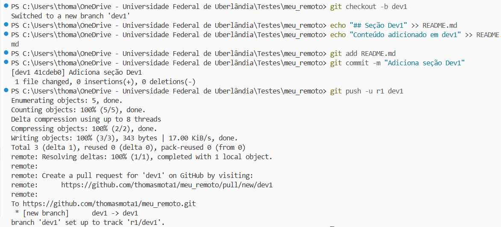

---

## Atividade 6: Colaborando com Ramos Remotos (2)

```bash
# 1. Colega faz edições em sequência
# (múltiplos commits no README)

# 2. Registra e envia ao remoto
# Colega executa: git push origin main

# 3. Receber mudanças com pull
git checkout main
git pull r1 main

# 4. Criar ramo fixes
git checkout -b fixes
echo "## Correções" >> README.md
git add README.md
git commit -m "Adiciona seção de correções"

# 5. Enviar ao remoto
git push -u r1 fixes

# 6. Fazer fusão e limpar
git checkout main
git merge fixes
git push r1 main
git branch -d fixes
git push r1 --delete fixes
```
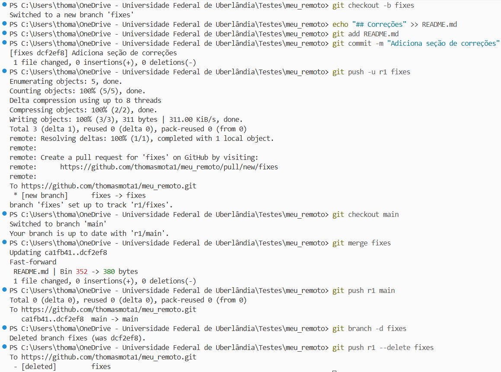

---

# Aula 4.2 - Git Katas

## Atividade 1: Basic Stashing

**Repositório:** https://github.com/eficode-academy/git-katas/blob/master/basic-stashing/README.md

### Exercícios realizados:

```bash
cd aulas/aula-02-controle-de-versoes/laboratorio-git/git-katas/basic-stashing
.\setup.ps1

# 1 Verificar estado inicial do repositório
git status
git status -s
git diff
git diff --staged
git log --oneline --all --graph

# 2 Guardar as alterações temporariamente
git stash

# 3 Conferir o estado após o stash
git status
git status -s
git stash list
git log --oneline --all --graph

# 4 Corrigir o arquivo com erro e registrar a correção
notepad bug.txt
git add bug.txt
git commit -m "Corrige erros em bug.txt"

# 5 Recuperar o trabalho salvo
git stash apply
git status
git status -s

# 6 Restaurar o estado para testar a recuperação com índice
git reset --hard HEAD
git stash apply --index
git status
git status -s

# 7 Remover o stash após recuperação
git stash drop
git stash list
git log --oneline --all --graph
```
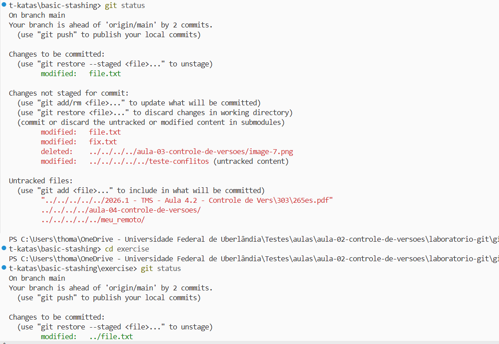
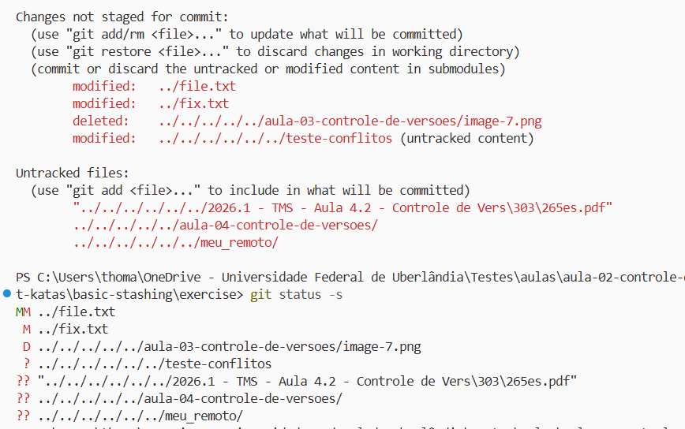
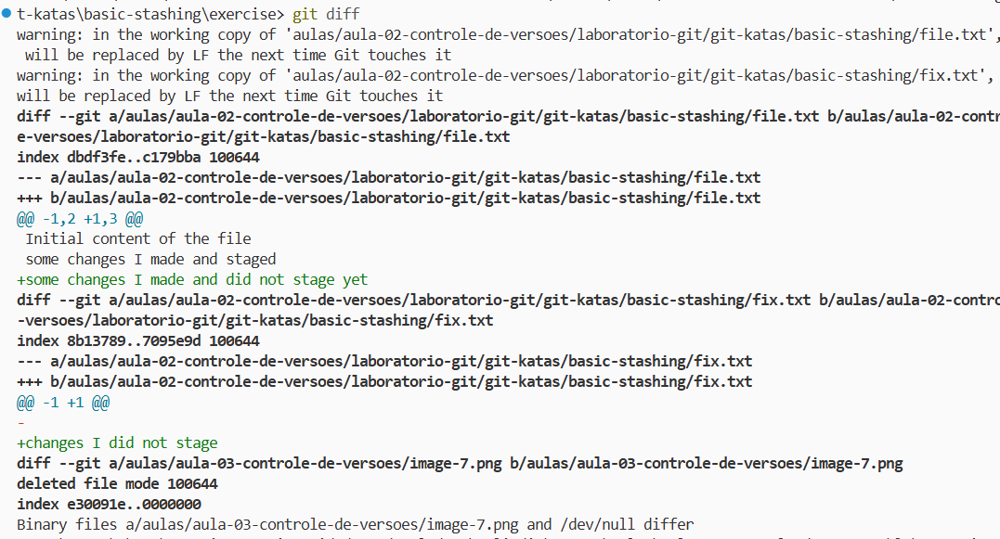
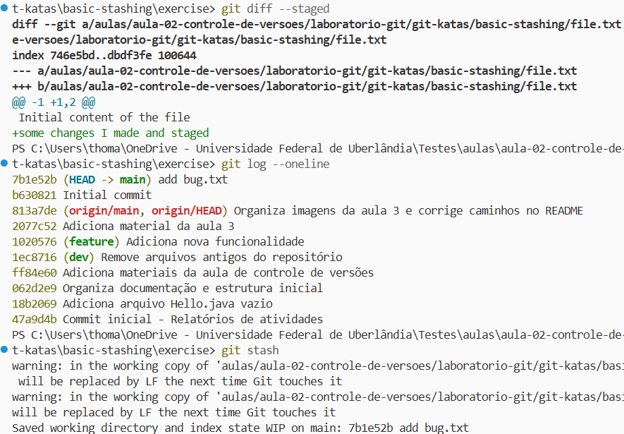
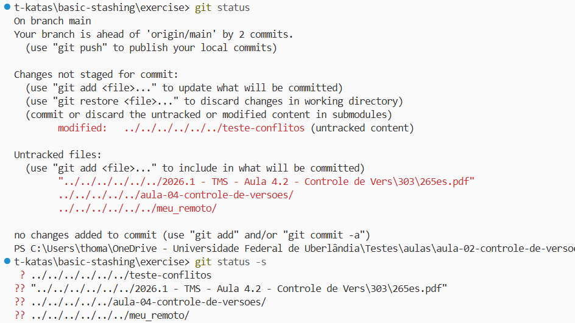
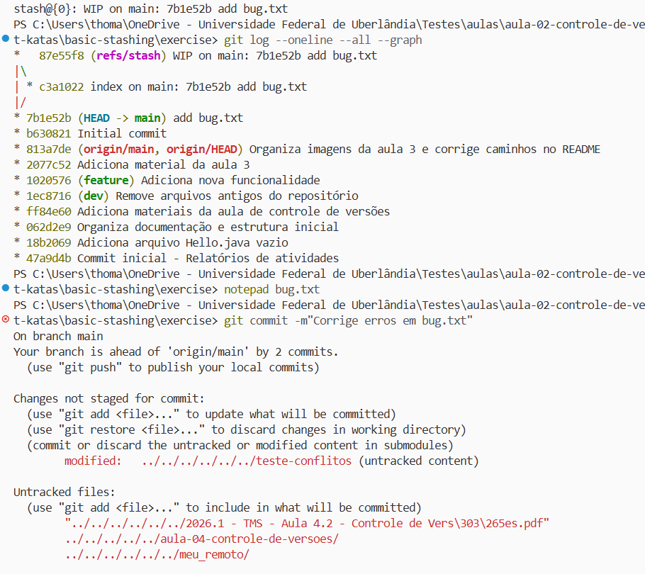
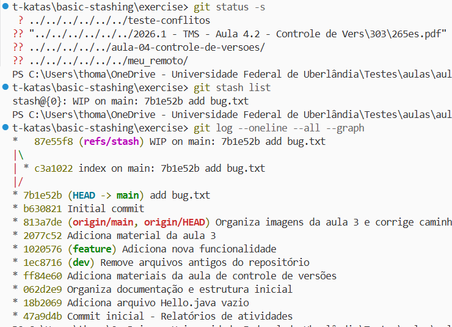
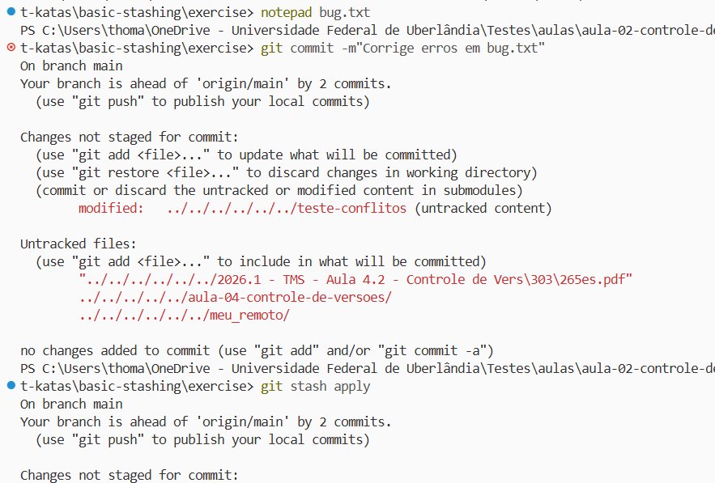

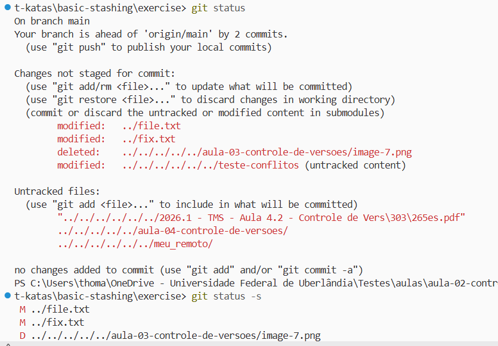
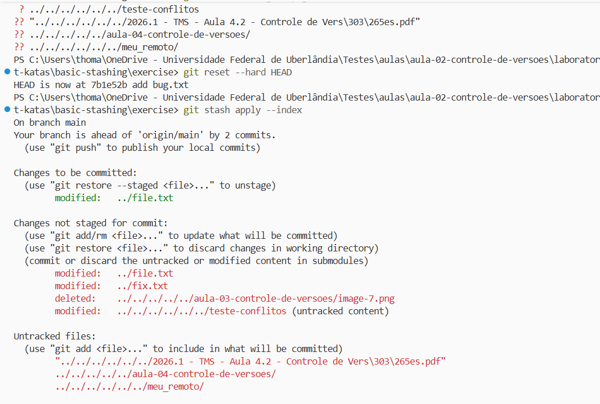
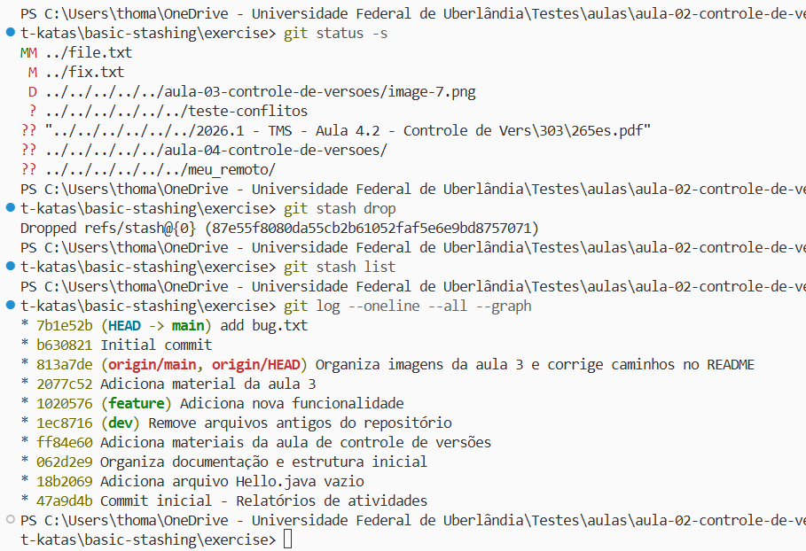


### Conceitos praticados:

- Uso de `git stash` para guardar alterações temporariamente
- Diferença entre alterações staged e unstaged
- Recuperação de alterações com `git stash apply`
- Recuperação mantendo o índice com `git stash apply --index`

---

## Atividade 2: Detached Head

**Repositório:** https://github.com/eficode-academy/git-katas/blob/master/detached-head/README.md

### Exercícios realizados:

```bash
cd ../detached-head
.\setup.ps1

# 1 Verificar o estado inicial
git status
git log --oneline --graph --all

# 2 Voltar para uma branch normal
git checkout master
git status
git log --oneline --graph --all

# 3 Entrar novamente em detached HEAD para entender o estado
git checkout HEAD~3
git status
git log --oneline --graph --all

# 4 Criar uma branch a partir do primeiro commit
git checkout -b the-beginning
git status
git log --oneline --graph --all
```
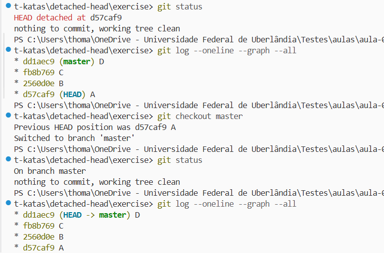
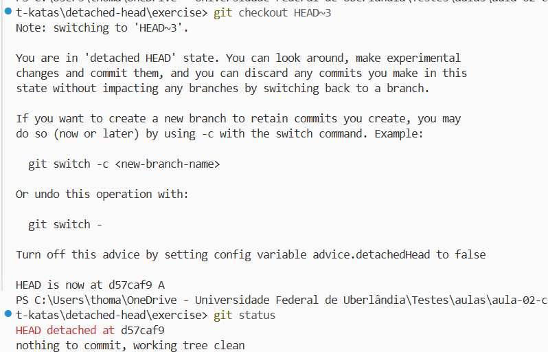
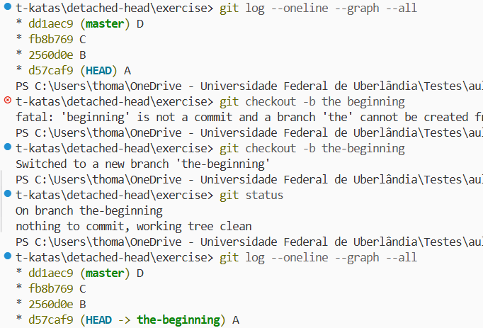

### Conceitos praticados:

- Identificação do estado `detached HEAD`
- Retorno para um ramo normal
- Criação de branch a partir de um commit específico

---

## Atividade 3: Reset

**Repositório:** https://github.com/eficode-academy/git-katas/blob/master/reset/README.md

### Exercícios realizados:

```bash
cd ../reset
.\setup.ps1

# 1 Verificar estado inicial
git status
git log --oneline --all --graph

# 2 Testar reset soft
git reset --soft HEAD~1
git status
git log --oneline --all --graph

# 3 Testar reset mixed
git reset --mixed HEAD~1
git status
git log --oneline --all --graph

# 4 Testar reset hard
git reset --hard HEAD~1
git status
git log --oneline --all --graph

# 5 Testar revert
git revert HEAD~1
git status
git log --oneline --all --graph
```
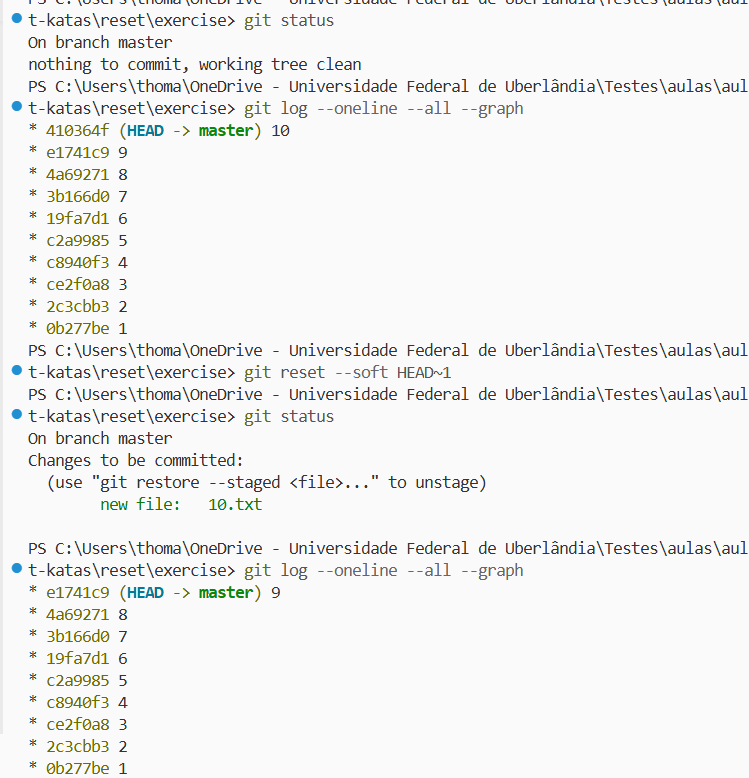
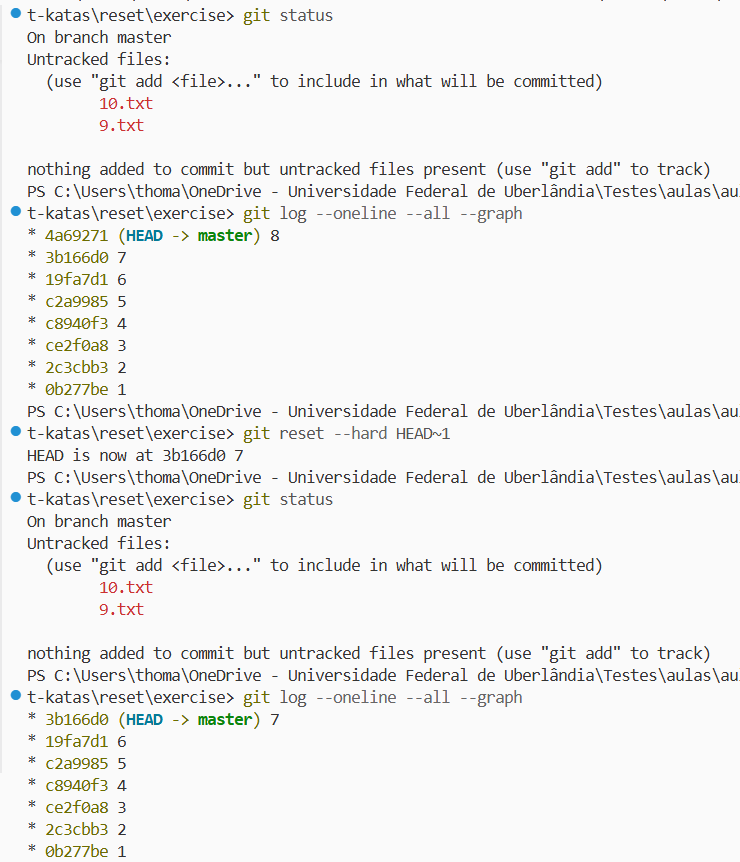
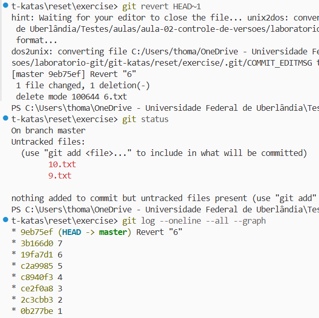

### Conceitos praticados:

- Diferença entre `git reset --soft`, `git reset --mixed` e `git reset --hard`
- Impacto do reset no histórico, área de staging e diretório de trabalho
- Uso de `git revert` para desfazer mudanças com segurança

---

## Atividade 4: Squashing

**Repositório:** https://github.com/eficode-academy/git-katas/blob/master/squashing/README.md

### Exercícios realizados:

```bash
cd ../squashing
.\setup.ps1

# 1 Verificar histórico inicial
git log --oneline --all --graph

# 2 Reescrever os cinco commits mais recentes
git rebase -i HEAD~5

# 3 Verificar histórico após o squash
git log --oneline --all --graph

# 4 Corrigir o conteúdo de file.txt sem criar novo commit
notepad file.txt
git add file.txt
git commit --amend

# 5 Verificar histórico final
git log --oneline --all --graph
```
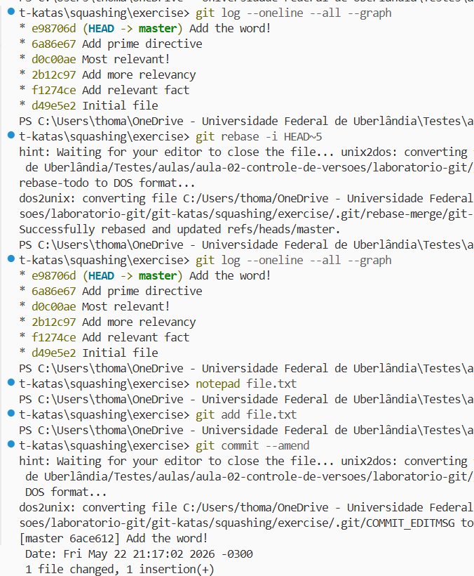
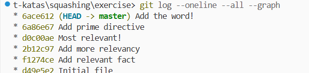

### Observações:

- No `git rebase -i HEAD~5`, mantenha o primeiro commit como `pick` e altere os demais para `squash` ou `s`.
- Depois edite a mensagem final para representar bem a funcionalidade consolidada.
- Em `file.txt`, remova os caracteres literais `\n` antes de usar `git commit --amend`.

### Conceitos praticados:

- Rebase interativo
- Squash de commits
- Limpeza de histórico
- Uso de `git commit --amend`

---

## Registro de Progresso

### O que foi feito:

- [x] Identificação das atividades da aula 4.2 no PDF
- [x] Organização dos comandos para os katas `basic-stashing`, `detached-head`, `reset` e `squashing`
- [x] Estruturação no mesmo formato usado nas aulas anteriores

### O que ficou pendente:

- [ ] Executar os comandos no terminal
- [ ] Registrar saídas e capturas de tela
- [ ] Ajustar observações finais após a execução prática

### O que impediu:

- Algumas etapas dependem de interação manual com editor e terminal

### O que será feito na sequência:

- Rodar cada kata manualmente
- Capturar os resultados
- Inserir imagens e saídas no relatório

---

## Referências


- [Git Katas](https://github.com/eficode-academy/git-katas)
