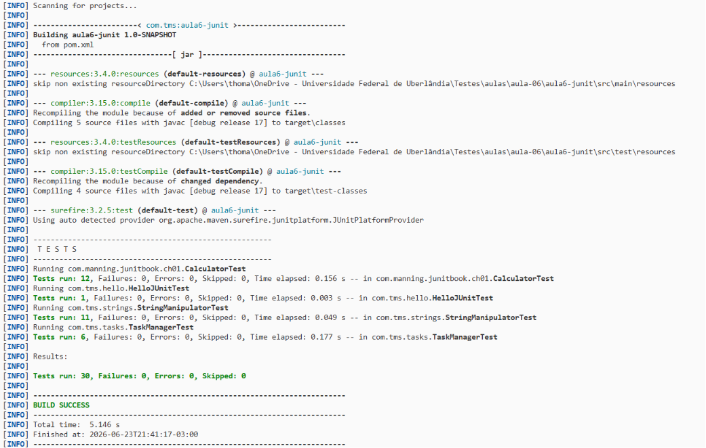

# Aula 6 - Frameworks para Automação de Testes - JUnit

**Aluno:** Thomas Gabriel Mota de Araújo
**Data:** 24/06/2026 - 26/06/2026

---

## Automação de Testes


## Atividade 1: Hello, World Tests!

### Classe HelloJUnit

```java
package com.tms.hello;

public class HelloJUnit {
    public String sayHello() {
        return "Hello, World of Tests!";
    }
}
```

### Classe HelloJUnitTest

```java
package com.tms.hello;

import static org.junit.jupiter.api.Assertions.assertEquals;
import org.junit.jupiter.api.Test;

public class HelloJUnitTest {

    @Test
    public void testSayHello() {
        HelloJUnit hello = new HelloJUnit();
        String result = hello.sayHello();
        assertEquals("Hello, World of Tests!", result);
    }
}
```

### Saída Esperada:
```
Tests run: 1, Failures: 0, Errors: 0, Skipped: 0
BUILD SUCCESS
```

---

## Atividade 2: A Calculadora

### Classe Calculator

```java
package com.manning.junitbook.ch01;

public class Calculator {

    public double add(double number1, double number2) {
        return number1 + number2;
    }
}
```

### Classe CalculatorTest

```java
package com.manning.junitbook.ch01;

import static org.junit.jupiter.api.Assertions.assertEquals;
import org.junit.jupiter.api.Test;

public class CalculatorTest {

    @Test
    public void testAdd() {
        Calculator calculator = new Calculator();
        double result = calculator.add(10, 50);
        assertEquals(60, result, 0);
    }
}
```

---

## Atividade 3: Estendendo a Calculadora

### Calculator Estendida

```java
package com.manning.junitbook.ch01;

public class Calculator {

    public double add(double number1, double number2) {
        return number1 + number2;
    }

    public double subtract(double number1, double number2) {
        return number1 - number2;
    }

    public double multiply(double number1, double number2) {
        return number1 * number2;
    }

    public double divide(double number1, double number2) {
        if (number2 == 0) {
            throw new ArithmeticException("Divisão por zero não permitida");
        }
        return number1 / number2;
    }
}
```

### CalculatorTest Estendida

```java
package com.manning.junitbook.ch01;

import static org.junit.jupiter.api.Assertions.*;
import org.junit.jupiter.api.BeforeEach;
import org.junit.jupiter.api.Test;

public class CalculatorTest {

    private Calculator calculator;

    @BeforeEach
    public void setUp() {
        calculator = new Calculator();
    }

    @Test
    public void testAdd() {
        assertEquals(60, calculator.add(10, 50), 0);
    }

    @Test
    public void testAddNegativeNumbers() {
        assertEquals(-15, calculator.add(-10, -5), 0);
    }

    @Test
    public void testAddWithZero() {
        assertEquals(10, calculator.add(10, 0), 0);
    }

    @Test
    public void testSubtract() {
        assertEquals(40, calculator.subtract(50, 10), 0);
    }

    @Test
    public void testSubtractNegativeResult() {
        assertEquals(-40, calculator.subtract(10, 50), 0);
    }

    @Test
    public void testMultiply() {
        assertEquals(500, calculator.multiply(10, 50), 0);
    }

    @Test
    public void testMultiplyByZero() {
        assertEquals(0, calculator.multiply(10, 0), 0);
    }

    @Test
    public void testMultiplyNegativeNumbers() {
        assertEquals(50, calculator.multiply(-10, -5), 0);
    }

    @Test
    public void testDivide() {
        assertEquals(5, calculator.divide(50, 10), 0);
    }

    @Test
    public void testDivideByZero() {
        assertThrows(ArithmeticException.class, () -> {
            calculator.divide(10, 0);
        });
    }

    @Test
    public void testDivideResultWithDecimals() {
        assertEquals(3.333, calculator.divide(10, 3), 0.001);
    }
}
```

---

## Atividade 4: Estendendo a Calculadora (2) - Raiz Quadrada e Potenciação

### Calculator com Novas Operações

```java
package com.manning.junitbook.ch01;

public class Calculator {

    public double add(double number1, double number2) {
        return number1 + number2;
    }

    public double subtract(double number1, double number2) {
        return number1 - number2;
    }

    public double multiply(double number1, double number2) {
        return number1 * number2;
    }

    public double divide(double number1, double number2) {
        if (number2 == 0) {
            throw new ArithmeticException("Divisão por zero não permitida");
        }
        return number1 / number2;
    }

    public double squareRoot(double number) {
        if (number < 0) {
            throw new IllegalArgumentException("Não é possível calcular raiz quadrada de número negativo");
        }
        return Math.sqrt(number);
    }

    public double power(double base, double exponent) {
        return Math.pow(base, exponent);
    }
}
```

### CalculatorTest com Testes Completos

```java
package com.manning.junitbook.ch01;

import static org.junit.jupiter.api.Assertions.*;
import org.junit.jupiter.api.*;
import org.junit.jupiter.params.ParameterizedTest;
import org.junit.jupiter.params.provider.CsvSource;
import org.junit.jupiter.params.provider.ValueSource;

public class CalculatorTest {

    private Calculator calculator;

    @BeforeEach
    public void setUp() {
        calculator = new Calculator();
    }

    @Test
    @DisplayName("Raiz quadrada de número positivo inteiro")
    void testSquareRootPositiveInteger() {
        assertEquals(3, calculator.squareRoot(9), 0);
        assertEquals(5, calculator.squareRoot(25), 0);
    }

    @Test
    @DisplayName("Raiz quadrada de número decimal")
    void testSquareRootDecimal() {
        assertEquals(1.414, calculator.squareRoot(2), 0.001);
        assertEquals(2.236, calculator.squareRoot(5), 0.001);
    }

    @Test
    @DisplayName("Raiz quadrada de zero")
    void testSquareRootZero() {
        assertEquals(0, calculator.squareRoot(0), 0);
    }

    @Test
    @DisplayName("Raiz quadrada de número negativo deve lançar exceção")
    void testSquareRootNegative() {
        assertThrows(IllegalArgumentException.class, () -> {
            calculator.squareRoot(-4);
        });
    }

    @Test
    @DisplayName("Raiz quadrada de valores limites")
    void testSquareRootLimits() {
        assertEquals(Math.sqrt(Double.MAX_VALUE), calculator.squareRoot(Double.MAX_VALUE), 0.001);
        assertEquals(
            Math.sqrt(Double.MIN_VALUE),
            calculator.squareRoot(Double.MIN_VALUE),
            0.0
        );
    }

    @Test
    @DisplayName("Potência com expoente positivo")
    void testPowerPositiveExponent() {
        assertEquals(8, calculator.power(2, 3), 0);
        assertEquals(81, calculator.power(3, 4), 0);
    }

    @Test
    @DisplayName("Potência com expoente zero")
    void testPowerZeroExponent() {
        assertEquals(1, calculator.power(5, 0), 0);
        assertEquals(1, calculator.power(100, 0), 0);
    }

    @Test
    @DisplayName("Potência com expoente negativo")
    void testPowerNegativeExponent() {
        assertEquals(0.125, calculator.power(2, -3), 0.001);
        assertEquals(0.01, calculator.power(10, -2), 0.001);
    }

    @Test
    @DisplayName("Potência com base negativa")
    void testPowerNegativeBase() {
        assertEquals(-8, calculator.power(-2, 3), 0);
        assertEquals(16, calculator.power(-2, 4), 0);
    }

    @Test
    @DisplayName("Potência com números decimais")
    void testPowerDecimal() {
        assertEquals(2.25, calculator.power(1.5, 2), 0.001);
        assertEquals(5.656, calculator.power(2, 2.5), 0.001);
    }

    @ParameterizedTest
    @CsvSource({
        "2, 0, 1",
        "2, 1, 2",
        "2, 2, 4",
        "2, 3, 8",
        "2, 10, 1024",
        "10, 3, 1000"
    })
    @DisplayName("Potência parametrizada")
    void testPowerParameterized(double base, double exponent, double expected) {
        assertEquals(expected, calculator.power(base, exponent), 0.001);
    }
}
```

---

## Atividade 5: Manipulação de Strings

### Classe StringManipulator

```java
package com.tms.strings;

import java.text.Normalizer;
import java.util.Locale;

public class StringManipulator {


    public String reverse(String str) {
        if (str == null) {
            throw new IllegalArgumentException("String não pode ser nula");
        }
        return new StringBuilder(str).reverse().toString();
    }


    public int countOccurrences(String str, char ch) {
        if (str == null) {
            throw new IllegalArgumentException("String não pode ser nula");
        }
        int count = 0;
        for (char c : str.toCharArray()) {
            if (c == ch) {
                count++;
            }
        }
        return count;
    }


    public boolean isPalindrome(String str) {
        if (str == null) {
            throw new IllegalArgumentException("String não pode ser nula");
        }
        String cleaned = Normalizer.normalize(str, Normalizer.Form.NFD)
                .replaceAll("\\p{M}", "")
                .replaceAll("[^\\p{L}\\p{N}]", "")
                .toLowerCase(Locale.ROOT);
        String reversed = new StringBuilder(cleaned).reverse().toString();
        return cleaned.equals(reversed);
    }


    public String toUpperCase(String str) {
        if (str == null) {
            throw new IllegalArgumentException("String não pode ser nula");
        }
        return str.toUpperCase(Locale.ROOT);
    }


    public String toLowerCase(String str) {
        if (str == null) {
            throw new IllegalArgumentException("String não pode ser nula");
        }
        return str.toLowerCase(Locale.ROOT);
    }
}
```

### Classe StringManipulatorTest

```java
package com.tms.strings;

import static org.junit.jupiter.api.Assertions.*;
import org.junit.jupiter.api.*;
import org.junit.jupiter.params.ParameterizedTest;
import org.junit.jupiter.params.provider.ValueSource;

public class StringManipulatorTest {

    private StringManipulator manipulator;

    @BeforeEach
    void setUp() {
        manipulator = new StringManipulator();
    }


    @Test
    @DisplayName("Inverter string normal")
    void testReverseNormal() {
        assertEquals("alO", manipulator.reverse("Ola"));
        assertEquals("odnum", manipulator.reverse("mundo"));
    }

    @Test
    @DisplayName("Inverter string vazia")
    void testReverseEmpty() {
        assertEquals("", manipulator.reverse(""));
    }

    @Test
    @DisplayName("Todas as operações com string nula devem lançar exceção")
    void testNullStrings() {
        assertAll(
            () -> assertThrows(IllegalArgumentException.class,
                    () -> manipulator.reverse(null)),
            () -> assertThrows(IllegalArgumentException.class,
                    () -> manipulator.countOccurrences(null, 'a')),
            () -> assertThrows(IllegalArgumentException.class,
                    () -> manipulator.isPalindrome(null)),
            () -> assertThrows(IllegalArgumentException.class,
                    () -> manipulator.toUpperCase(null)),
            () -> assertThrows(IllegalArgumentException.class,
                    () -> manipulator.toLowerCase(null))
        );
    }

    @Test
    @DisplayName("Inverter string com caracteres especiais")
    void testReverseSpecialChars() {
        assertEquals("!@#$%", manipulator.reverse("%$#@!"));
        assertEquals("ã ó", manipulator.reverse("ó ã"));
    }

    @Test
    @DisplayName("Inverter string longa")
    void testReverseLong() {
        String longString = "a".repeat(10000);
        assertEquals(longString, manipulator.reverse(longString));
    }


    @Test
    @DisplayName("Contar ocorrências em string normal")
    void testCountOccurrencesNormal() {
        assertEquals(3, manipulator.countOccurrences("banana", 'a'));
        assertEquals(2, manipulator.countOccurrences("banana", 'n'));
    }

    @Test
    @DisplayName("Contar ocorrências quando não existe")
    void testCountOccurrencesNotFound() {
        assertEquals(0, manipulator.countOccurrences("hello", 'z'));
    }

    @Test
    @DisplayName("Contar ocorrências em string vazia")
    void testCountOccurrencesEmpty() {
        assertEquals(0, manipulator.countOccurrences("", 'a'));
    }

    @Test
    @DisplayName("Contar ocorrências de caractere especial")
    void testCountOccurrencesSpecialChar() {
        assertEquals(3, manipulator.countOccurrences("a@b@c@", '@'));
    }


    @ParameterizedTest
    @ValueSource(strings = {"ama", "arara", "A man a plan a canal Panama", "Was it a car or a cat I saw"})
    @DisplayName("Strings que são palíndromos")
    void testIsPalindromeTrue(String str) {
        assertTrue(manipulator.isPalindrome(str));
    }

    @ParameterizedTest
    @ValueSource(strings = {"hello", "world", "java"})
    @DisplayName("Strings que não são palíndromos")
    void testIsPalindromeFalse(String str) {
        assertFalse(manipulator.isPalindrome(str));
    }

    @Test
    @DisplayName("String vazia é palíndromo")
    void testIsPalindromeEmpty() {
        assertTrue(manipulator.isPalindrome(""));
    }

    @Test
    @DisplayName("String de um caractere é palíndromo")
    void testIsPalindromeSingleChar() {
        assertTrue(manipulator.isPalindrome("a"));
    }

    @Test
    @DisplayName("Palíndromo com caracteres acentuados")
    void testIsPalindromeAccented() {
        assertTrue(manipulator.isPalindrome("Socorram-me, subi no ônibus em Marrocos"));
    }


    @Test
    @DisplayName("Converter para maiúsculas")
    void testToUpperCase() {
        assertEquals("HELLO WORLD", manipulator.toUpperCase("Hello World"));
        assertEquals("123ABC", manipulator.toUpperCase("123abc"));
    }

    @Test
    @DisplayName("Converter para minúsculas")
    void testToLowerCase() {
        assertEquals("hello world", manipulator.toLowerCase("Hello World"));
        assertEquals("123abc", manipulator.toLowerCase("123ABC"));
    }

    @Test
    @DisplayName("Conversão com string vazia")
    void testCaseConversionEmpty() {
        assertEquals("", manipulator.toUpperCase(""));
        assertEquals("", manipulator.toLowerCase(""));
    }

    @Test
    @DisplayName("Conversão com caracteres acentuados")
    void testCaseConversionAccented() {
        assertEquals("AÇÃO", manipulator.toUpperCase("ação"));
        assertEquals("ação", manipulator.toLowerCase("AÇÃO"));
    }
}
```

---

## Atividade 6: Gerenciadora de Tarefas

### Classe Task

```java
package com.tms.tasks;

import java.time.LocalDateTime;
import java.util.Objects;

public class Task {
    private String id;
    private String title;
    private String description;
    private boolean completed;
    private LocalDateTime createdAt;
    private LocalDateTime completedAt;

    public Task(String id, String title, String description) {
        this(id, title, description, false, LocalDateTime.now(), null);
    }

    public Task(String id, String title, String description, boolean completed,
                LocalDateTime createdAt, LocalDateTime completedAt) {
        this.id = id;
        this.title = title;
        this.description = description;
        this.completed = completed;
        this.createdAt = createdAt;
        this.completedAt = completedAt;
    }

    public String getId() { return id; }
    public String getTitle() { return title; }
    public String getDescription() { return description; }
    public boolean isCompleted() { return completed; }
    public LocalDateTime getCreatedAt() { return createdAt; }
    public LocalDateTime getCompletedAt() { return completedAt; }

    public void setTitle(String title) { this.title = title; }
    public void setDescription(String description) { this.description = description; }

    public void markAsCompleted() {
        this.completed = true;
        this.completedAt = LocalDateTime.now();
    }

    public void markAsIncomplete() {
        this.completed = false;
        this.completedAt = null;
    }

    @Override
    public boolean equals(Object o) {
        if (this == o) return true;
        if (o == null || getClass() != o.getClass()) return false;
        Task task = (Task) o;
        return Objects.equals(id, task.id);
    }

    @Override
    public int hashCode() {
        return Objects.hash(id);
    }
}
```

### Classe TaskManager

```java
package com.tms.tasks;

import java.io.*;
import java.time.LocalDateTime;
import java.util.*;
import java.util.stream.Collectors;

public class TaskManager {
    private List<Task> tasks;

    public TaskManager() {
        this.tasks = new ArrayList<>();
    }

    public void addTask(Task task) {
        if (task == null) {
            throw new IllegalArgumentException("Tarefa não pode ser nula");
        }
        if (tasks.contains(task)) {
            throw new IllegalStateException("Tarefa já existe: " + task.getId());
        }
        tasks.add(task);
    }

    public boolean removeTask(String taskId) {
        return tasks.removeIf(t -> t.getId().equals(taskId));
    }

    public void markAsCompleted(String taskId) {
        Task task = findById(taskId);
        if (task != null) {
            task.markAsCompleted();
        }
    }

    public void markAllAsCompleted() {
        tasks.forEach(Task::markAsCompleted);
    }

    public Task findById(String taskId) {
        return tasks.stream()
                .filter(t -> t.getId().equals(taskId))
                .findFirst()
                .orElse(null);
    }

    public List<Task> filterByStatus(boolean completed) {
        return tasks.stream()
                .filter(t -> t.isCompleted() == completed)
                .collect(Collectors.toList());
    }

    public List<Task> getTasksSortedByCreationDate() {
        return tasks.stream()
                .sorted(Comparator.comparing(Task::getCreatedAt))
                .collect(Collectors.toList());
    }

    public List<Task> getAllTasks() {
        return new ArrayList<>(tasks);
    }

    public int getTaskCount() {
        return tasks.size();
    }

    public void saveToFile(String filename) throws IOException {
        try (PrintWriter writer = new PrintWriter(new FileWriter(filename))) {
            for (Task task : tasks) {
                writer.println(task.getId() + ";" + task.getTitle() + ";" +
                        task.getDescription() + ";" + task.isCompleted() + ";" +
                        task.getCreatedAt() + ";" +
                        (task.getCompletedAt() == null ? "" : task.getCompletedAt()));
            }
        }
    }

    public void loadFromFile(String filename) throws IOException {
        tasks.clear();
        try (BufferedReader reader = new BufferedReader(new FileReader(filename))) {
            String line;
            while ((line = reader.readLine()) != null) {
                String[] parts = line.split(";", -1);
                boolean completed = Boolean.parseBoolean(parts[3]);
                LocalDateTime createdAt = LocalDateTime.parse(parts[4]);
                LocalDateTime completedAt = parts[5].isEmpty()
                        ? null
                        : LocalDateTime.parse(parts[5]);
                Task task = new Task(parts[0], parts[1], parts[2], completed,
                        createdAt, completedAt);
                tasks.add(task);
            }
        }
    }
}
```

### Classe TaskManagerTest

```java
package com.tms.tasks;

import static org.junit.jupiter.api.Assertions.*;
import org.junit.jupiter.api.*;
import java.io.*;
import java.nio.file.*;
import java.util.List;

public class TaskManagerTest {

    private TaskManager manager;
    private Task task1, task2, task3;

    @BeforeEach
    void setUp() {
        manager = new TaskManager();
        task1 = new Task("1", "Estudar JUnit", "Ler documentação");
        task2 = new Task("2", "Fazer exercícios", "Completar katas");
        task3 = new Task("3", "Revisar código", "Code review do PR");
    }


    @Test
    @DisplayName("Adicionar tarefa com sucesso")
    void testAddTask() {
        manager.addTask(task1);
        assertEquals(1, manager.getTaskCount());
        assertNotNull(manager.findById("1"));
    }

    @Test
    @DisplayName("Adicionar tarefa nula deve lançar exceção")
    void testAddNullTask() {
        assertThrows(IllegalArgumentException.class, () -> {
            manager.addTask(null);
        });
    }

    @Test
    @DisplayName("Adicionar tarefa duplicada deve lançar exceção")
    void testAddDuplicateTask() {
        manager.addTask(task1);
        assertThrows(IllegalStateException.class, () -> {
            manager.addTask(task1);
        });
    }


    @Test
    @DisplayName("Remover tarefa existente")
    void testRemoveTask() {
        manager.addTask(task1);
        assertTrue(manager.removeTask("1"));
        assertEquals(0, manager.getTaskCount());
    }

    @Test
    @DisplayName("Remover tarefa inexistente retorna false")
    void testRemoveNonexistentTask() {
        assertFalse(manager.removeTask("999"));
    }


    @Test
    @DisplayName("Marcar tarefa como concluída")
    void testMarkAsCompleted() {
        manager.addTask(task1);
        manager.markAsCompleted("1");
        assertTrue(manager.findById("1").isCompleted());
    }

    @Test
    @DisplayName("Marcar todas as tarefas como concluídas")
    void testMarkAllAsCompleted() {
        manager.addTask(task1);
        manager.addTask(task2);
        manager.addTask(task3);

        manager.markAllAsCompleted();

        assertTrue(manager.findById("1").isCompleted());
        assertTrue(manager.findById("2").isCompleted());
        assertTrue(manager.findById("3").isCompleted());
    }


    @Test
    @DisplayName("Filtrar tarefas concluídas")
    void testFilterCompleted() {
        manager.addTask(task1);
        manager.addTask(task2);
        task1.markAsCompleted();

        List<Task> completed = manager.filterByStatus(true);
        assertEquals(1, completed.size());
        assertEquals("1", completed.get(0).getId());
    }

    @Test
    @DisplayName("Filtrar tarefas pendentes")
    void testFilterPending() {
        manager.addTask(task1);
        manager.addTask(task2);
        task1.markAsCompleted();

        List<Task> pending = manager.filterByStatus(false);
        assertEquals(1, pending.size());
        assertEquals("2", pending.get(0).getId());
    }


    @Test
    @DisplayName("Ordenar tarefas por data de criação")
    void testSortByCreationDate() throws InterruptedException {
        Task first = new Task("1", "Primeira", "");
        Thread.sleep(10);
        Task second = new Task("2", "Segunda", "");
        Thread.sleep(10);
        Task third = new Task("3", "Terceira", "");

        manager.addTask(third);
        manager.addTask(first);
        manager.addTask(second);

        List<Task> sorted = manager.getTasksSortedByCreationDate();
        assertEquals(
            List.of("1", "2", "3"),
            sorted.stream().map(Task::getId).toList()
        );
    }


    @Test
    @DisplayName("Salvar e carregar tarefas de arquivo")
    void testSaveAndLoad() throws IOException {
        Path tempFile = Files.createTempFile("tasks", ".txt");
        String filename = tempFile.toString();

        try {
            manager.addTask(task1);
            manager.addTask(task2);
            task1.markAsCompleted();

            manager.saveToFile(filename);

            TaskManager newManager = new TaskManager();
            newManager.loadFromFile(filename);

            assertEquals(2, newManager.getTaskCount());
            assertTrue(newManager.findById("1").isCompleted());
            assertFalse(newManager.findById("2").isCompleted());
            assertEquals(task1.getTitle(), newManager.findById("1").getTitle());
            assertEquals(task1.getDescription(), newManager.findById("1").getDescription());
            assertEquals(task1.getCreatedAt(), newManager.findById("1").getCreatedAt());
            assertEquals(task1.getCompletedAt(), newManager.findById("1").getCompletedAt());
        } finally {
            Files.deleteIfExists(tempFile);
        }
    }
}
```

---


## Registro de Progresso

### Resultado da execução

Comando executado no projeto `aulas/aula-06/aula6-junit`:

```powershell
mvn test
```


Resultado obtido em 23/06/2026 e 24/06/2026:

```text
[INFO] Tests run: 30, Failures: 0, Errors: 0, Skipped: 0
[INFO] 
[INFO] ------------------------------------------------------------------------
[INFO] BUILD SUCCESS
[INFO] ------------------------------------------------------------------------
[INFO] Total time:  5.146 s
[INFO] Finished at: 2026-06-23T21:41:17-03:00
[INFO] ------------------------------------------------------------------------
```

### O que foi feito:
- [x] Compreensão do conceito de automação de testes
- [x] Estudo dos frameworks de testes disponíveis
- [x] Introdução ao JUnit e sua história
- [x] Configuração do ambiente com Maven
- [x] Implementação do "Hello, World Tests!"
- [x] Implementação e teste da Calculadora básica
- [x] Extensão da Calculadora com subtração, multiplicação e divisão
- [x] Extensão da Calculadora com raiz quadrada e potenciação
- [x] Testes com números inteiros, decimais, valores limites e negativos
- [x] Implementação da classe StringManipulator (inverter, contar, palíndromo, case)
- [x] Testes com strings vazias, nulas, especiais, curtas e longas
- [x] Implementação da classe TaskManager (CRUD de tarefas)
- [x] Testes de filtro por status e ordenação por data
- [x] Testes de persistência em arquivo (salvar/carregar)
- [x] Estudo do ciclo de vida dos testes JUnit
- [x] Compreensão das principais assertions


### O que impediu:
- Nada impediu a conclusão das atividades

---

